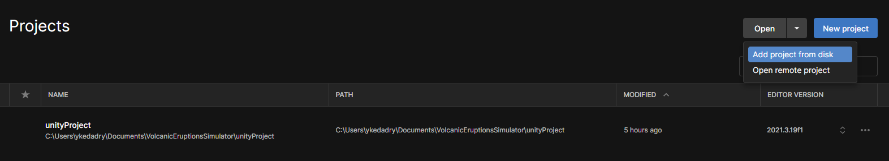

# Howto

## Dependencies

- Install [UnityHub and Unity](https://unity.com/download) for your distribution (available for Mac, Windows and Linux)

- Clone the project
```sh
git clone https://github.com/MrBigoudi/VolcanicEruptionsSimulator.git
```

## To launch the simulation

- Add the `VolcanicEruptionsSimulator/unityProject` to your UnityHub projects



- Open the project by clicking on its name and run the simulation by pressing the `play` button


## Tweakable values

During or before the simulation you can change some values.

### Before the simulation

- `Volcano Image` -> Select the terrain for the simulation. This also move the camera and scale the terrain accordingly (see [TerrainGenerator.cs](unityProject/Assets/Scripts/TerrainGenerator.cs))

- `Gaussian Blur` -> Check the box if you want to smooth the terrain a bit (see [ParticleSPHGPU.cs](unityProject/Assets/Scripts/ParticleSPHGPU.cs) and [ParticleSPHGPU.compute](unityProject/Assets/Scripts/Shaders/ParticleSPHGPU.compute))

- `Nb Max Particles` -> Enter the maximum number of particles you want to generate (see [ParticleSPHGPU.cs](unityProject/Assets/Scripts/ParticleSPHGPU.cs))

### During the simulation

- `Display Particles` -> Check the box if you want to display particles (WARNING, unity doesn't handle `discard` very well so particles will only be visible if the `ParticleDisplay` object is visible (see [ParticleDisplay.cs](unityProject/Assets/Scripts/ParticleDisplay.cs) and [ParticleShader.shader](unityProject/Assets/Resources/ParticleShader.shader)))

- `Display Lava` -> Check the box if you want to display the lava (see [TerrainShader.shader](unityProject/Assets/Resources/TerrainShader.shader))

- `Initial Position Delta` -> Select the radius arround the `ParticleMaker` object in which particles can spawn

- `DT` -> Select the delta time between each update

- `Spike` -> Select the factor to increase or decrease the rendered lava height

- `Kernel Radius` -> The kernel radius for physical quantities updates

- `Render Kernel Radius` -> The kernel radius to update the terrain heights for the rendering part

- `Particles Mesh Heights` -> Select the height of the rendered particles (for debug purposes), if `== 0` particles will be sticking to the ground, if `< 0` particles will be undergroundand if `> 0` particles will be above the terrain (WARNING, the calculation is based on the initial terrain heights so if there is a lot of lava above a particle, the particle will be hidden under it)

- `Mu` -> The constant viscosity

- `Ke` -> The initial viscosity (i.e. the viscosity at temperature `ThetaE`)

- `ThetaE` -> The initial lava temperature

- `Color Shade` -> The value used to shade the lava color according to the temperature (see [TerrainShader.shader](unityProject/Assets/Resources/TerrainShader.shader))

## Movements

It is possible to move arround the scene during the simulation. The controls are the following (see [FlyCamera.cs](unityProject/Assets/Scripts/FlyCamera.cs) for more details):

- `W` -> Move forward

- `S` -> Move backward

- `D` -> Move left

- `A` -> Move right

- `E` -> Go up

- `Q` -> Go down

- `holding Shift + any of the above` -> Go faster

- `holding mouse Right Click + moving the mouse` -> Rotate the camera

- `Scroll down` -> Zoom out

- `Scroll up` -> Zoom in

- `holding mouse Middle Click + moving the mouse` -> Translate the camera (like with W, S, D, A)