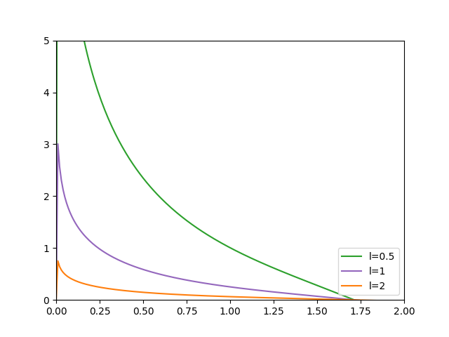
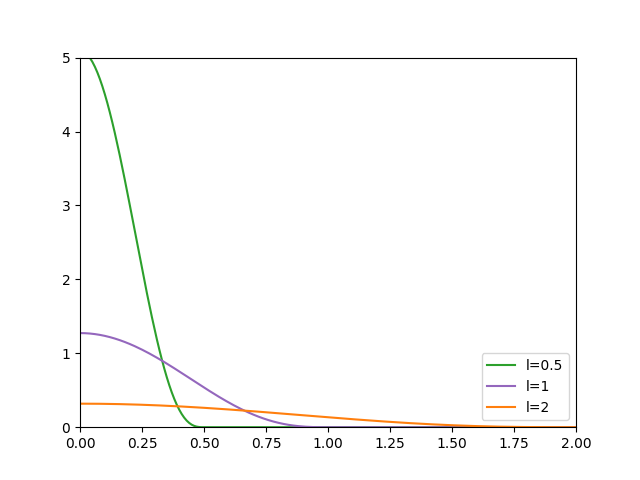
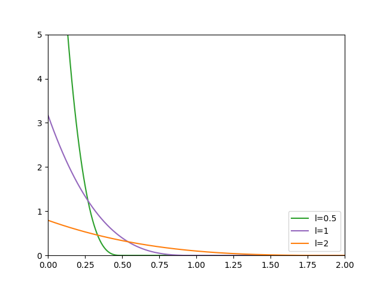
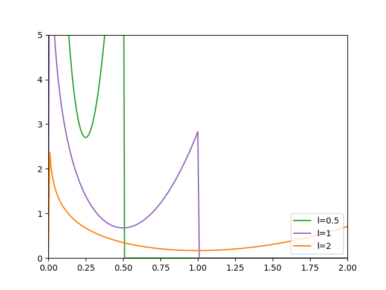

# VolcanicEruptionsSimulator
An [eruption simulator](https://github.com/MrBigoudi/VolcanicEruptionsSimulator) implemented in Unity.

# Abstract

Lava flows, from their visually stunning aspects and their impressive birth from the heart of the Earth always fascinated Humanity. In Computer Graphics the lava flow is however a challenging natural phenomenon to simulate due to the complex physical mechanisms involved during the descent of the fluid. While a multitude of techniques is used to simulate different types of fluids, none can fully capture and model the complexity of lava flows in both a realistic and efficient enough way to render it in real time. Consequently, this work presents a Lagrangian method to efficiently simulate lava flows in real-time by approximating their behavior using the 2D Shallow Water Equations derived from the Navier-Stokes fluid equations and developing a new smoothing kernel from a Green’s function to incorporate viscosity forces. This model takes advantage of the precision offered by the grid-free displacement of particle-based models while using the parallel computational power of modern GPU for both the rendering and the physics to once again fasten the computation.

# Contents

1. [Introduction](#introduction)<br/>
    &ensp;1.1 [Motivations and Context](#motivations)<br/>
    &ensp;1.2 [Method and Contributions](#contributions)<br/>
2. [Previous work](#previous)<br/>
    &ensp;2.1 [2D fluid simulations](#fluid)<br/>
    &ensp;2.2 [Viscosity](#viscosity)<br/>
3. [Method](#method)<br/>
    &ensp;3.1 [SPH and SWE](#sphswe)<br/>
        &ensp;&ensp;&ensp;&ensp;&ensp;3.1.1 [Smoothed Particle Hydrodynamics](#sph)<br/>
        &ensp;&ensp;&ensp;&ensp;&ensp;3.1.2 [Shallow Water Equations](#swe)<br/>
    &ensp;3.2 [Grids](#grids)<br/>
        &ensp;&ensp;&ensp;&ensp;&ensp;3.2.1 [Neighbors grid](#neighbors)<br/>
        &ensp;&ensp;&ensp;&ensp;&ensp;3.2.2 [Staggered grid](#staggered)<br/>
    &ensp;3.3 [Viscosity](#viscosity)<br/>
    &ensp;3.4 [Implementation](#implementation)<br/>
        &ensp;&ensp;&ensp;&ensp;&ensp;3.4.1 [The Algorithm](#algo)<br/>
        &ensp;&ensp;&ensp;&ensp;&ensp;3.4.2 [Shader Implementation](#shader)<br/>
4. [Results](#results)<br/>
    &ensp;4.1 [Overview of the results](#overview)<br/>
    &ensp;4.2 [Discussion and future work](#future)<br/>

<a id="introduction"></a>
# 1. Introduction

<a id="motivations"></a>
## 1.1 Motivations and Context

The main focus of this Internship was to simulate lava flows in a physically accurate manner. It was an incredible opportunity to learn about many aspects of the research world in Computer Graphics. Either learning the full process of a research project by diving into previous works, finding a new research direction while constantly dealing with setbacks and new research plans but also by always being interested in other works in Computer Graphics in general. The researchers from the GraphDeco team at Inria work in many different fields from machine learning models for rendering to procedural terrain generation passing by materials and textures blending. Through meetings, exchanges, and mutual help between lab members we gather a global view of the ongoing work in the Computer Graphics world.

Lava flows are a natural phenomenon both visually stunning and potentially catastrophic for the hundreds of millions of people living near a volcanic area. The development of physical and mathematical models is then a key point to help create tools to prevent possible threats caused by such natural phenomena. Even in a less predictive manner, the visual aspects brung by these tools can also be used in the entertainment industry by being incorporated into video games or movies for example. Simulating an entire volcano is a hard task in computer graphics. Usually, this work is split into different fields from the study of volcanoes topography changes [[MNT19]](#MNT19) to the modelization of complex plume ejections [[LRC∗22]](#LRC*22). However, another important part is the simulation of lava flows after a volcanic eruption. Several physical models and numerical methods have already been applied to simulate lava flow since the earliest fluid simulations in computer graphics [[SAC∗99]](#SAC*99). However, due to its complex rheology, lava is hard to accurately simulate unless drastically augmenting the computational cost of the model [[HBV∗11]](#HBV*11).

<a id="contributions"></a>
## 1.2 Method and contributions

We propose a Lagrangian method implemented entirely inside the GPU to tackle the problem of the lava flow simulation. Our model tries to find a balance between physical realism and fast computational time to efficiently render a flow in real-time. Since lava can be seen as a really thin layer of fluid going down a slope, we can use the simplified 2D Shallow Water Equations (SWE) from the more complex Navier-Stokes equations to handle the lava dynamics. This will result in an easier and faster implementation of the fluid’s mechanics. These simplified equations have been used in the past to represent fluid motions in computer graphics [[LH10]](#LH10) but, to our knowledge, they have never been used to represent more viscous fluids such as lava. To compute the viscosity forces needed to simulate lava flows, our key observation is that we can separate the vertical and horizontal components of the viscosity and approximate the latter using Green’s functions. These functions have the same behavior as a Smoothed Particle Hydrodynamics (SPH) kernel and can then be derived to a new one which allows us to diffuse the velocity of particles as any other physical quantity in an SPH simulation.

Our method is based on a particle-based model to take advantage of the precision offered by the grid-free displacement of particles. The idea is to use a 2D Smoothed Particle Hydrodynamics [[BMF07]](#BMF07) system with particles storing physical pieces of information such as the height of a given column of lava and also use a Staggered Grid storing attributes of the terrain to fasten the calculations. Every time step the simulation is updated using both the SPH and SWE to change the particles’ positions. Another important aspect of a lava simulation is the impact of the viscosity. We represent its behavior inside a new kernel based on one of Green’s functions. With this method, a physically accurate real-time simulation of a lava flow from a volcanic eruption is possible. The main contributions of our work are:

- Use of a Lagrangian Shallow Water method to represent a thin viscous fluid

- A fully GPU implementation to achieve a real-time update of the simulation and a fast
rendering using only an evolutive heightmap

- Derive a new smoothing kernel from a Green’s function to update particles velocities while
taking into account viscosity forces

<a id="previous"></a>
# 2. Previous work

Fluid simulation is an important topic in Computer Graphics. It gathers the modelizations of liquids but also gaseous phenomena and highly deformable bodies. Within this variety of materials, viscous fluids are still a challenge to simulate in real-time.

<a id="fluid"></a>
## 2.1 2D Fluid simulations

The State of The Art Lagrangian methods for fluid simulations is derivated from the SPH model first introduced by Monaghan in 1977 [[GM77]](#GM77) for the simulation of astrophysical phenomena. The idea behind SPH is to see fluids as discretized fields of particles. SPH is an interpolation method for a particle system in which every discrete element stores physical quantities that are then distributed and updated in a local neighborhood using radial symmetrical smoothing kernels (see section [3.1](#sph) for a more detailed overview of the SPH simulation). Because of its wide use, SPH has been modified to handle different kinds of fluids from water [[MCG03]](#MCG03) to smoke [[SF95]](#SF95) or even viscous liquids (see section [2.2](#viscosity)). One of the main limitations of early SPH methods was the computational time. To reduce it, Becker and Teschner, introduced the Weakly Compressible SPH (WCSPH) [[BT07]](#BT07) in 2007 that uses the Tait equation for pressure calculations to avoid implausible simulation due to compressibility and reduces the computation per time step. However, even if the computation time decreased per time step, by not using the Poisson method they introduced smaller delta times between each update. Another method to compute the pressure term was introduced by Solenthaler in 2009 [[SP09]](#SP09). In the Predictive-Corrective Incompressible SPH (PCISPH) method, they try to predict the pressure term using an implicit scheme that allowed a time step ten times bigger than for WCSPH. This method was improved by Ihmsen, Solenthaler and Teschner with the Implicit Incompressible SPH (IISPH) model in 2014 [[ICS∗14]](#ICS*14) which, by considering the computation of the pressure force inside their prediction scheme, improves the convergence rate of the solver and thus the overall speed of the simulation. However, all these approaches are limited by the calculation of the pressure term. One idea to avoid its calculation is then reducing the simulation domain from 3D to 2D.

By doing so, we can use simplified versions of the Navier-Stokes equations. One of them is the Shallow Water Equations (SWE). They were first introduced in fluid simulations to model waves with an Eulerian approach [[LvdP02]](#LvdP02) where they include a 2D velocity field in addition to the surface height. A particle-based shallow water method (SPHSWE) has then been introduced by Lee and Hann in 2010 [[LH10]](#LH10) where they represented solid objects using ghost particles to include a one-way coupling of particles with solid objects. One issue of their method was the bumpy surfaces generated when particles were too sparse. Solenthaler and M ̈uller [[SBC∗11]](#SBC*11) then extended the Lee and Hann model by introducing a two-way coupling of particles with rigid bodies and solved the bumpy surfaces issue by using a surface representation based on the underlying density field that improved the rendering of low-density particle regions.

<a id="viscosity"></a>
## 2.2 Viscosity

One important part of the fluid simulation is the handle of viscosity. In the early days of fluid simulations, only fluids with relatively low viscosity were simulated because of the State of the Art explicit methods used at the time. Explicit and implicit schemes are both dependent on the Courant-Friedrichs-Lewy (CFL) condition [[BMF07]](#BMF07) on the time step. However, to preserve the stability of viscous models, explicit schemes must also have time steps ∆t inversely proportional to the viscosity. This means that the higher the viscosity was, the lower the time steps were to preserve stability which lead to more computational time. Early works in fluid simulations were based on Eulerian views. The idea was to use a grid to update physical quantities throughout the simulation. In 1996, Foster and Metaxas [[FM96]](#FM96) introduced an explicit Eulerian model using finite differences to solve the Navier-Stokes equations. To stabilize the model, Stam [[Sta01]](#Sta01) proposed in 1999 a stable fluid method using an implicit viscosity integration for numerical stability. In 2002, Carlson et al. [[CMVHT02]](#CMVHT02) introduced the first fully implicit scheme for the diffusion component of viscous fluids equations and treated solid materials as very high viscous fluids. Batty and Bridson [[BB08]](#BB08) then improved the method in 2008.

For Lagrangian simulations, Ihmsen et al. in 2015 [[PICT15]](#PICT15) also used an implicit scheme to handle viscosity forces. They decomposed the gradient into three tensors and used the target gradient to ensure that pressure and viscosity computation do not interfere. However, their improvements made low viscous fluids not realistically simulated anymore. Weiler et al. [[WKBB18]](#WKBB18) then properly defined requirements for a viscous fluid solver and derived an implicit Lagrangian scheme to fulfill them. They adopted a combination of SPH derivative and finite differences to compute the Laplacian of the velocity field that conserves linear and angular momentum compared to the standard SPH discretization of the Laplacian. Although implicit schemes removethe time step limit of explicit schemes, they require the solution of a linear system which can be hard to compute depending on the fluid properties.

For example, for the simulation of lava flow, geoscientists have presented different models. In 2011 H ́erault et al. [[HBV∗11]](#HBV*11) proposed to compute the apparent viscosity using a modified Bingham model derived from the original Papansatasiou model [[Pap87]](#Pap87). While being physically accurate their simulation, even if implemented with SPH in the GPU using the CUDA architecture of NVIDIA, was slow and took hours or days to run. Bernabeu et al. [[BSS16]](#BSS16) then used the viscoplastic Herschel-Bulkley constitutive equation to express the stress tensor in terms of the shear rate tensor and the temperature. The complex lava rheology makes implicit schemes hard to implement for real-time applications. Our method follows a simplified version of the Herschel-Bulkley model presented in [[BSS16]](#Bss16). We rely on one of Green’s functions as a smoothing kernel to diffuse the velocities and approximate the viscosity impact on their evolution. Our model uses an explicit scheme to avoid the computation of the linear system solution which permits a real-time simulation of the lava flow.

<a id="method"></a>
# 3. Method

Our method uses 2D SPH particles to solve the Shallow Water Equations. We also use different grids to update the simulation and have derived a new kernel to include viscosity forces. In the following, we present an overview of all the steps for our simulation.

<a id="sphswe"></a>
## 3.1 SPH and SWE

The foundations of our simulation are the Smoothed Particle Hydrodynamics (SPH) and the Shallow Water Equations (SWE). This section presents a brief overview of the basic SPH and SWE equations. For a more detailed derivation and description of both models, we refer the reader to [[Mon05]](#Mon05) and [[BMF07]](#BMF07).

<a id="sph"></a>
### 3.1.1 Smoothed Particle Hydrodynamics

The idea behind SPH simulations is to discretize fluid volume using particles. During the simulation, each particle represents a certain amount of volume and stores physical properties. These properties are then updated throughout the simulation using the values of neighbor particles. A quantity $q_i$ at an arbitrary position $x_i$ is approximately computed with a set of known quantities $q_j$ at neighboring particle positions $x_j$ :
<a id="eq:sph"></a>
$$
\begin{equation}
    q_i = \sum_j \frac{m_j}{\rho_j}q_jW_{ij}
\end{equation}
$$

Where $m_j$ and $\rho_j$ are respectively the mass and the density carried by the particle $j$ and $W_{ij}$ is a smoothing kernel of the form
<a id="eq:sph_kernel"></a>
$$
\begin{equation}
    W_{ij} = W(x_i - x_j, l)
\end{equation}
$$

$l$ being the kernel's radius or smoothing length. The mass stays constant during the simulation and for our model, we set it to $m = (\frac{2}{3}l)^3$ as proposed in [[IOS*14]](#IOS*14).
One of the advantages of the SPH model resides in the ease of how to derivate quantities. Thanks to equation [1](#eq:sph), we do not need to use finite differences or a grid to compute the derivatives of fluid quantities. Instead, we can directly obtain the spatial derivatives of a quantity $q_i$ using the following equations:
<a id="eq:sph_derivatives"></a>
$$
\begin{align}
    \nabla{q_i} &= \sum_j \frac{m_j}{\rho_j}q_j\nabla{W_{ij}}\\
    \nabla\cdot{q_i} &= \sum_j \frac{m_j}{\rho_j}q_j\cdot\nabla{W_{ij}}\\
    \nabla^2{q_i} &= \sum_j \frac{m_j}{\rho_j}q_j\nabla^2{W_{ij}}
\end{align}
$$

With that, we can easily get the gradient (equation [3](#eq:sph_derivatives)), the divergence (equation [4](#eq:sph_derivatives)) and the laplacian (equation [5](#eq:sph_derivatives)) of a quantity $q_i$. An important part of the simulation then resides in the smoothing kernels. For our simulation, from the three 2D kernels presented in [[SBC*11]](#SBC*11):
<a id="eq:sph_kernels"></a>
$$
\begin{align}
    W_{\text{poly6}}(r,l) &= \frac{4}{\pi l^8} \begin{cases}
                                                (l^2-r^2)^3& \text{if } 0 \leq r \leq l\\
                                                0              & \text{otherwise}
                                            \end{cases}\\
    W_{\text{spiky}}(r,l) &= \frac{10}{\pi l^5} \begin{cases}
                                                (l-r)^3& \text{if } 0 \leq r \leq l\\
                                                0              & \text{otherwise}
                                            \end{cases}\\
    W_{\text{visc}}(r,l) &= \frac{10}{9\pi l^5} \begin{cases}
                                                -4r^3 + 9r^2l -5l^3 + 6l^3(\ln{l}-\ln{r})& \text{if } 0 < r \leq l\\
                                                0              & \text{otherwise}
                                            \end{cases}
\end{align}
$$

we used the poly6 kernel (equation [6](#eq:sph_kernels)) because of its smoother distribution when $r$ tends to $0$.
For 2D SPH, the volume $V_i = \frac{m_i}{\rho_0}$ stays constant during the simulation and, as presented in [[LH10]](#LH10), the volume in a 2D simulation takes the role of the mass in a 3D simulation, and the height in 2D can be seen as the density in 3D. The equations [1](#eq:sph), [3](#eq:sph_derivatives), [4](#eq:sph_derivatives) and [5](#eq:sph_derivatives) then become:
<a id="eq:sph_2d"></a>
$$
\begin{align}
    q_i &= \sum_j \frac{V_j}{h_j}q_jW_{ij}\\
    \nabla{q_i} &= \sum_j \frac{V_j}{h_j}q_j\nabla{W_{ij}}\\
    \nabla\cdot{q_i} &= \sum_j \frac{V_j}{h_j}q_j\cdot\nabla{W_{ij}}\\
    \nabla^2{q_i} &= \sum_j \frac{V_j}{h_j}q_j\nabla^2{W_{ij}}
\end{align}
$$

<a id="swe"></a>
### 3.1.2 Shallow Water Equations

The shallow water equations are derived from the Navier-Stokes equations and use a 2D height field to describe the evolution of the surface of a liquid. They represent the conservation of volume and momentum and can be written as:
<a id="eq:swe"></a>
$$
\begin{align}
    \frac{Du}{Dt} &= -\vec{g}\nabla{S} + \vec{F}_{ext}\\
    \frac{Dh}{Dt} &= -h\nabla\cdot u
\end{align}
$$

Where $u$ is the 2D horizontal water velocity, $g$ is the gravity and $h$ is the height of liquid above the ground. $S = h + H$ is the surface at a given position, with $H$ being the height of the terrain underneath the fluid at that position (see Figure [3.1](#fig:lava_column)).
<a id="fig:lava_column"></a>
<p align="center">
  
</p>
<p align="center">
    Figure 3.1: A column of lava
</p>

In our simulation, instead of using equation [14](#eq:swe) to update the height stored for each particle, we directly use the SPH equations [9](#eq:sph_2d) to update the heights as any other physical quantity. In a similar way, the gradient of the surface $\nabla{S}$ is decomposed into its two components $\nabla{S} = \nabla{h} + \nabla{H}$; the height gradient $\nabla{h}$ is computed using the SPH formula [10](#eq:sph_2d) while we get the terrain height gradient using a staggered grid (see Section [3.2.2](#staggered)).

<a id="grids"></a>
## 3.2 Grids

Our model is also based on two different grids: one is used to compute and update particle neighbors at each time step and the other one is a staggered grid fixed from the beginning which stores terrain properties.

<a id="neighbors"></a>
### 3.2.1 Neighbors grid

Another advantage of using a 2D SPHSWE method is the efficiency in terms of the number of particles needed to represent the fluid. Every particle is projected directly into the x and y plane so only one layer of particles is enough to simulate the fluid instead of the multiple layers model used in standard SPH. The neighbors search problem is often a bottleneck in SPH simulations and the State of the Art solution is the Delaunay triangulation [[CNGT14]](#CNGT14). However, this algorithm is hard to implement and since we have the advantage of dealing with fewer particles we could use a simpler but effective uniform grid for the search. The idea is that each cell contains indices of particles that belong to the cell while every particle store the index of the cell they are in. The grid is a 2D one for which the width and height of the cells are equal to the SPH kernel radius $l$ (Figure [3.2a](#fig:neighbor_grid)). When searching neighbors of a given particle $p_i$ we can then access the particle's grid in $\mathcal{O}(1)$, then find the other neighboring cells in $\mathcal{O}(1)$ and finally get the list of each particle $p_j$ inside the cells and check if the distance between $p_i$ and $p_j$ is lesser than $l$ in $\mathcal{O}(k)$ with $k$ the average numbers of particles inside a cell.
<a id="fig:neighbor_grid"></a>
<p align="center">
  
</p>
<p align="center">
    Figure 3.2a: The neighbor grid
</p>

<a id="staggered"></a>
### 3.2.2 Staggered grid

The other important grid of our simulation is the staggered grid or Marker-and-Cell (MAC) grid [[HW65]](#HW65). The idea of such a grid is to store variables at different locations. We then use the values inside of it and an accurate bilinear central difference (Equation [22](#eq:bilinear)) to sample these values for every particle. For example, by storing the terrain heights at discrete positions which are the center of our grid cells, we can sample the z coordinate of a particle knowing its position in the 2D plane. In our grid (Figure [3.2b](#fig:staggeres_grid)) we store the terrain heights at the center of every cell, the terrain half heights between cells and the terrain height gradients at every corner. Because the gradient values are not defined at every cell, we put a $0$ when they are not to ease the calculations for the interpolations.
Let $q$ be a quantity, to estimate its derivative $\frac{\partial{q}}{\partial{x}}$ at a grid point $j,i$ without any bias, the natural idea is to use the first central difference:
<a id="eq:first_central_diff"></a>
$$
\begin{equation}
    (\frac{\partial{q}}{\partial{x}})_{j,i} = \frac{q_{j,i+1}-q_{j,i-1}}{2\Delta x}
\end{equation}
$$

This is unbiased and accurate to $\mathcal{O}(\Delta x^2)$ compared to a forward of backward difference such as: 
<a id="eq:forward_diff"></a>
$$
\begin{equation}
    (\frac{\partial{q}}{\partial{x}})_{j,i} = \frac{q_{j,i+1}-q_{j,i}}{\Delta x}
\end{equation}
$$

which is biased to the right and only accurate to $\mathcal{O}(\Delta x)$. The issue with formula \ref{eq:first_central_diff} is that it does not take into account the value at $q_{j,i}$ which can lead to incorrect interpretations if we have a spike at $q_{j,i}$ (for example, having $q_{j,i+1} = q_{j,i-1}$ and $q_{j,i+1} << q_{j,i}$).
To solve this problem, we sample values at halfway points in the grid and then get the derivatives using:
<a id="eq:grad_grid"></a>
$$
\begin{equation}
    (\frac{\partial{q}}{\partial{x}})_{j,i} = \frac{q_{j,i+1/2}-q_{j,i-1/2}}{2\Delta x}
\end{equation}
$$

This is unbiased and accurate to $\mathcal{O}(\Delta x^2)$. For our staggered grid (Figure \ref{fig:staggeredGrid}), we have:
<a id="eq:stag_values"></a>
$$
\begin{align}
    & H_{j, i} & \rightarrow & \hspace{5mm}\text{Fetched from the terrain heightmap}\\
    & H_{j, i+1/2} & \rightarrow & \hspace{5mm}\text{Bilinear interpolation of the surrounding heights}\\
    & H_{j+1/2, i} & \rightarrow & \hspace{5mm}\text{Bilinear interpolation of the surrounding heights}\\
    & \nabla H_{j+1/2, i+1/2} & = & \hspace{5mm}(\frac{H_{j, i+1/2}-H_{j, i-1/2}}{\Delta x}, \frac{H_{j+1/2, i}-H_{j-1/2, i}}{\Delta y})
\end{align}
$$

<a id="fig:staggered_grid"></a>
<p align="center">
  
</p>
<p align="center">
    Figure 3.2b: The staggered grid
</p>

The staggered grid is built once at the beginning of the simulation. Then, when we want to get a value at a given point $p = (x,y,z)$ like a particle's position, we bilinearly interpolate the values surrounding it (see Figure [3.3](#fig:bilinear)):
<a id="eq:bilinear"></a>
$$
\begin{equation}
    f(p) = \frac{1}{(x_2-x_1)(y_2-y_1)}
    \begin{pmatrix}
        x_2-x & x-x_1
    \end{pmatrix} 
    \begin{pmatrix}
        f(w_{11}) & f(w_{12})\\
        f(w_{21}) & f(w_{22})
    \end{pmatrix}
    \begin{pmatrix}
        y_2-y\\
        y-y_1
    \end{pmatrix} 
\end{equation}
$$

<a id="fig:bilinear"></a>
<p align="center">
  
</p>
<p align="center">
    Figure 3.3: The bilinear interpolation at point p
</p>

<a id="viscosity"></a>
## 3.3 Viscosity

To add viscous force to our model, we start with the momentum conservation law:
<a id="eq:visc_momentum_1"></a>
$$
\begin{equation}
    \frac{d\vec{u}}{dt} + (\vec{u}\cdot\nabla)\vec{u} = \frac{\nabla\cdot\sigma}{\rho} + \vec{g}
\end{equation}
$$

With $\vec{u}$ the position, $\rho$ the density, $\vec{g}$ the gravity and $\sigma = -p\cdot I + \tau$ is the Cauchy stress tensor where $p$ is the pressure, $I$ the identity tensor and $\tau$ the stress tensor. By decomposing the Cauchy stress tensor and using the linear distribution of the divergence operator, we get:
<a id="eq:visc_momentum_2"></a>
$$
\begin{equation}
    \frac{d\vec{u}}{dt} + (\vec{u}\cdot\nabla)\vec{u} = -\frac{\nabla\cdot \text{pI}}{\rho} + \frac{\nabla\cdot\tau}{\rho} + \vec{g}
\end{equation}
$$

Knowing our model is 2D we can further simplify the equation. From Stokes, we know that the left side of the equation becomes $\vec{0}$. Moreover, based on the Blatter model from glaciology (Blatter 1995 [[Bla95]](#Bla95) and Jouvet 2016 [[Jou16]](#Jou16)), we can eliminate the vertical component of the velocity which leads to the elimination of the pressure term and the addition of the surface's gradient $\nabla{S}$ (see Figure [3.1](#fig:lava_column)) on the right-hand side of the equation. Then, multiplying by the density, equation [24](#eq:visc_momentum_2) becomes:
<a id="eq:visc_momentum_3"></a>
$$
\begin{equation}
    \vec{0} = \nabla\cdot\tau + \rho\vec{g}\nabla{S}
\end{equation}
$$
This reminds us of the Shallow Water Equation [13](#eq:swe).

We use a constitutive Herschel-Bulkley equation simplified from [[BSS16]](#BSS16) to express the stress tensor in terms of the viscosity $\mu$, the strain rate tensor $\epsilon$ and a function of the temperature $\theta$:
<a id="eq:visc_herschel_bulkley_1"></a>
$$
\begin{equation}
    \tau = f(\theta)\mu\epsilon
\end{equation}
$$

Like in [[BSS16]](#BSS16), $f$ is approximated by an Arrhenius law $f(\theta) = K_ee^{\alpha(\theta_e-\theta)}$ where $\theta_e$ is the initial lava temperature, $K_e$ is the fluid viscosity at $\theta_e$ temperature and $\alpha = 810^{-3}\text{K}^{-1}$ is the constant used by Bernabeu et al. (for a complete list of variables and values used for the simulation, you can refer to the Table [3.1](#tab:variables)). The strain rate tensor is the same as in [[CJP*23]](#CJP*23):
<a id="eq:visc_strain_rate_1"></a>
$$
\begin{align}
    \epsilon & = \nabla\vec{u} + \nabla\vec{u}^\intercal \\
    & = \begin{pmatrix}
        \frac{\partial{u_x}}{\partial{x}} & \frac{1}{2}(\frac{\partial{u_x}}{\partial{y}}+\frac{\partial{u_y}}{\partial{x}}) & \frac{1}{2}\frac{\partial{u_x}}{\partial{z}}\\
        \frac{1}{2}(\frac{\partial{u_x}}{\partial{y}}+\frac{\partial{u_y}}{\partial{x}}) & \frac{\partial{u_y}}{\partial{y}} & \frac{1}{2}\frac{\partial{u_y}}{\partial{z}}\\
        \frac{1}{2}\frac{\partial{u_x}}{\partial{z}} & \frac{1}{2}\frac{\partial{u_y}}{\partial{z}} & -\frac{\partial{u_x}}{\partial{x}}-\frac{\partial{u_y}}{\partial{y}}  
    \end{pmatrix}\nonumber
\end{align}
$$

and as a first approximation we will consider $\mu$ constant (see the discussion [4.2](#future) for more details). Because our model is in 2D, we simplify the strain rate tensor keeping only its 2D components and equation [27](#eq:visc_strain_rate_1) becomes:
<a id="eq:visc_strain_rate_2"></a>
$$
\begin{equation}
    \epsilon = \begin{pmatrix}
        \frac{\partial{u_x}}{\partial{x}} & \frac{1}{2}(\frac{\partial{u_x}}{\partial{y}}+\frac{\partial{u_y}}{\partial{x}}) & \frac{1}{2}\frac{\partial{u_x}}{\partial{z}}\\
        \frac{1}{2}(\frac{\partial{u_x}}{\partial{y}}+\frac{\partial{u_y}}{\partial{x}}) & \frac{\partial{u_y}}{\partial{y}} & \frac{1}{2}\frac{\partial{u_y}}{\partial{z}}
    \end{pmatrix}
\end{equation}
$$

Deriving equations [25](eq:visc_momentum_3), [26](eq:visc_herschel_bulkley_1) and [28](eq:visc_strain_rate_2) while once again using the linear distribution of the divergence operator we get:
<a id="eq:visc_momentum_4"></a>
$$
\begin{equation}
    f(\theta)\mu\begin{pmatrix}
        \frac{\partial^2{u_x}}{\partial{x^2}} + \frac{1}{2}\frac{\partial^2{u_x}}{\partial{y^2}} + \frac{1}{2}\frac{\partial^2{u_y}}{\partial{x}\partial{y}} + \frac{1}{2}\frac{\partial^2{u_x}}{\partial{z^2}}\\
        \frac{\partial^2{u_y}}{\partial{y^2}} + \frac{1}{2}\frac{\partial^2{u_y}}{\partial{x^2}} + \frac{1}{2}\frac{\partial^2{u_x}}{\partial{x}\partial{y}} + \frac{1}{2}\frac{\partial^2{u_y}}{\partial{z^2}}
    \end{pmatrix} = -\rho\vec{g}\nabla{S}
\end{equation}
$$

As an approximation, we also chose to remove the crossed terms and equation [29](eq:visc_momentum_4) becomes:
<a id="eq:visc_momentum_5"></a>
$$
\begin{equation}
    f(\theta)\mu\begin{pmatrix}
        \frac{\partial^2{u_x}}{\partial{x^2}} + \frac{1}{2}\frac{\partial^2{u_x}}{\partial{y^2}} + \frac{1}{2}\frac{\partial^2{u_x}}{\partial{z^2}}\\
        \frac{\partial^2{u_y}}{\partial{y^2}} + \frac{1}{2}\frac{\partial^2{u_y}}{\partial{x^2}} + \frac{1}{2}\frac{\partial^2{u_y}}{\partial{z^2}}
    \end{pmatrix} = -\rho\vec{g}\nabla{S}
\end{equation}
$$

From there, we want to integrate over the lava columns to get the averaged velocity inside the columns at each point of the terrain (see Figure [3.1](#fig:lava_column)). To do so, we begin by integrating over $z$ between an arbitrary height $z$ and the surface of the flow $h$ over that $z$ (for readability, we will only write the integral in $u_x$):
<a id="eq:visc_integral_1"></a>
$$
\begin{align}
    \int_{z}^{h} \frac{\partial^2{u_x}}{\partial{x^2}} + \frac{1}{2}\frac{\partial^2{u_x}}{\partial{y^2}} + \frac{1}{2}\frac{\partial^2{u_x}}{\partial{z^2}}\,dz & = \frac{1}{f(\theta)\mu}\int_{z}^{h} -\rho\vec{g}\nabla{S}\,dz\nonumber\\
    \frac{\partial}{\partial{x}}\int_{z}^{h} \frac{\partial{u_x}}{\partial{x}}\,dz + \frac{1}{2}\frac{\partial}{\partial{y}}\int_{z}^{h} \frac{\partial{u_x}}{\partial{y}}\,dz + \frac{1}{2}\left[\frac{\partial{u_x}}{\partial{z}}\right]_z^{h} & = -(h-z)\frac{\rho\vec{g}\nabla{S}}{f(\theta)\mu}
\end{align}
$$

The velocity is null on the free surface so $\frac{\partial{u_x}}{\partial{z}}(z_h) = 0$ and equation [31](#eq:visc_integral_1) becomes:
<a id="eq:visc_integral_2"></a>
$$
\begin{equation}
    \frac{\partial}{\partial{x}}\int_{z}^{h} \frac{\partial{u_x}}{\partial{x}}\,dz + \frac{1}{2}\frac{\partial}{\partial{y}}\int_{z}^{h} \frac{\partial{u_x}}{\partial{y}}\,dz - \frac{1}{2}\frac{\partial{u_x}}{\partial{z}} = -(h-z)\frac{\rho\vec{g}\nabla{S}}{f(\theta)\mu}
\end{equation}
$$

We integrate again but this time between the bottom of the flow $0$ and $z$:
<a id="eq:visc_integral_3"></a>
$$
\begin{equation}
    \frac{\partial}{\partial{x^2}}\int_{0}^{z'}\int_{z}^{h} u_x\,dz\,dz' + \frac{1}{2}\frac{\partial}{\partial{y^2}}\int_{0}^{z'}\int_{z}^{h} u_x\,dz\,dz' - \frac{1}{2}\left[u_x\right]_{0}^{z} = -(hz'-\frac{1}{2}z'^2)\frac{\rho\vec{g}\nabla{S}}{f(\theta)\mu}
\end{equation}
$$

The velocity at the bottom of the flow is $0$, so equation [33](#eq:visc_integral_3) becomes:
<a id="eq:visc_integral_4"></a>
$$
\begin{equation}
    \frac{\partial}{\partial{x^2}}\int_{0}^{z'}\int_{z}^{h} u_x\,dz\,dz' + \frac{1}{2}\frac{\partial}{\partial{y^2}}\int_{0}^{z'}\int_{z}^{h} u_x\,dz\,dz' - \frac{1}{2}u_x = -(hz'-\frac{1}{2}z'^2)\frac{\rho\vec{g}\nabla{S}}{f(\theta)\mu}
\end{equation}
$$

Finally to get the average velocity on the column we integrate between $0$ and $h$ before dividing by $h$ (for readability, we removed the $\,dz$ inside the integrals):
<a id="eq:visc_integral_5"></a>
$$
\begin{align}
    \frac{1}{h}(\int_{0}^{h}\frac{\partial}{\partial{x^2}}\int_{0}^{z'}\int_{z}^{h} u_x + \frac{1}{2}\int_{0}^{h}\frac{\partial}{\partial{y^2}}\int_{0}^{z'}\int_{z}^{h} u_x - \frac{1}{2}h\bar{u}) &= \frac{-1}{h}(\frac{1}{2}h^3-\frac{1}{6}h^3)\frac{\rho\vec{g}\nabla{S}}{f(\theta)\mu}\nonumber\\
    \frac{\partial}{\partial{x^2}}\frac{1}{3}h^3\bar{u} + \frac{1}{2}\frac{\partial}{\partial{y^2}}\frac{1}{3}h^3\bar{u}- \frac{1}{2}h\bar{u} &= -(\frac{1}{3}h^3\frac{\rho\vec{g}\nabla{S}}{f(\theta)\mu})
\end{align}
$$

Where $\bar{u}$ is the average velocity on the column. Let's now write $u' = h^3\bar{u}$. The equation now becomes:
<a id="eq:visc_integral_6"></a>
$$
\begin{equation}
    \frac{\partial}{\partial{x^2}}u' + \frac{1}{2}\frac{\partial}{\partial{y^2}}u' - \frac{3}{2}u'h^4 = -(h^3\frac{\rho\vec{g}\nabla{S}}{f(\theta)\mu})
\end{equation}
$$

The equation now looks close to one of Green's functions where the differential operator $L$ is of the form $\nabla^2u - k^2u = b$. Because the height shouldn't impact differently the velocities on the $x$ and $y$ coordinates, we will arrange the equation [36](#eq:visc_integral_6). It now matches the form of the differential operator:
<a id="eq:visc_integral_7"></a>
$$
\begin{align}
    \frac{\partial}{\partial{x^2}}u' + \frac{\partial}{\partial{y^2}}u' - \frac{3}{2}\frac{u'}{h^2} &= -(h^3\frac{\rho\vec{g}\nabla{S}}{f(\theta)\mu})\nonumber\\
    \nabla^2{u'} - k^2u' = b_j
\end{align}
$$

With $\rho = \rho_0$ as the constant lava density (see Table [3.1](#tab:variables)), $k = \sqrt{\frac{3}{2}}h^2$ and $b = -(h_j^3\frac{\rho\vec{g}\nabla{S}}{f(\theta_j)\mu})$. The intuition behind using Green's functions is that they can be seen as smoothing kernels working the same way as an SPH one that we could apply to the particles' velocities. For the given differential operator, we know that the associated Green's function in 2D is
<a id="eq:green_function"></a>
$$
\begin{equation}
    G(u) = -\frac{1}{2\pi}K_0(kr)
\end{equation}
$$

Where $r = \sqrt{u_x^2 + u_y^2 + u_z^2}$ and
<a id="eq:modified_bessel"></a>
$$
\begin{equation}
    K_0 = \int_{0}^{+\infty} \frac{\cos{(xt)}}{\sqrt{t^2+1}}\,dt
\end{equation}
$$

is a modified Bessel function. To update particles' velocities we therefore only need to use the following formula:
<a id="eq:sph_green"></a>
$$
\begin{align}
    \bar{u_i} &= h_i^3\frac{\sum_jG(u_j)*b_j}{\sum_jG(u_j)}\nonumber\\
    \bar{u_i} &= h_i^3\frac{\sum_jK_0(kr)*b_j}{\sum_jK_0(kr)}
\end{align}
$$

<a id="fig:graph_bessel"></a>
<p align="center">
    
</p>
<p align="center">
    Figure 3.4a: Modified Bessel function K0
</p>

<a id="fig:graph_new_kernel"></a>
<p align="center">
    
</p>
<p align="center">
    Figure 3.4b: New kernel
</p>

The graph of the modified Bessel function is presented in Figure [3.4a](#fig:graph_bessel). We can see that it looks like a smoothing kernel by comparing it to the 3 kernels presented in Section [3.1.1](#sph) (see Figure [3.5](#fig:graph_sph_kernel)).
<a id="fig:graph_poly6"></a>
<p align="center">
    
</p>
<p align="center">
    Figure 3.5a: Wpoly6
</p>

<a id="fig:graph_spiky"></a>
<p align="center">
    
</p>
<p align="center">
    Figure 3.5b: Wspiky
</p>

<a id="fig:graph_visc"></a>
<p align="center">
    
</p>
<p align="center">
    Figure 3.5c: Wvisc
</p>

However, none of these kernels are close enough to the Bessel function. To fix this issue, we have designed a new smoothing kernel. To design such a kernel we begin by simplifying the modified Bessel function [39](#eq:modified_bessel) in its series expansion at x=0:
<a id="eq:modified_bessel_series"></a>
$$
\begin{equation}
    K_0 \approx (-\log{(x)} - \gamma + \log{(2)}) + \frac{1}{4}x^2(-\log{(x)} - \gamma + 1 + \log{(2)})
\end{equation}
$$

Where $\gamma \approx 0.577216$ is the Euler’s constant. Then we need to create a kernel $W(r,l)$ such that:
<a id="eq:new_kernel"></a>
$$
\begin{equation}
    W_{\text{new}}(r,l) = \frac{1}{l^2}k\begin{cases}
                                                K_0(r)& \text{if } 0 < r \leq l\\
                                                0     & \text{otherwise}
                                            \end{cases} 
\end{equation}
$$

The $\frac{1}{l^2}$ is necessary because it is a 2D kernel (see [[Mon05]](#Mon05)) and $k$ is a normalizing constant because we want to use normalized smoothing kernels (see [[MCG03]](#MCG03)). To find the normalizing constant we integrate the Bessel function [42](#eq:modified_bessel) and we get
<a id="eq:normalizing_cst"></a>
$$
\begin{equation}
    \frac{1}{k} = \int_{0}^{+\infty} K_0(x)\,dx = \frac{\pi}{2}
\end{equation}
$$

The new kernel \ref{eq:new_kernel} is then:
<a id="eq:new_kernel_final"></a>
$$
\begin{align}
    W_{\text{new}}(r,l) &= \frac{2}{\pi l^2}\begin{cases}
                                                K_0(r)& \text{if } 0 < r \leq l\\
                                                0     & \text{otherwise}
                                            \end{cases} \nonumber \\
    W_{\text{new}}(r,l) &= \frac{2}{\pi l^2}\begin{cases}
                                                ((-\log{(r)} - \gamma + \log{(2)}) + \frac{1}{4}r^2(-\log{(r)} - \gamma + 1 + \log{(2)}))& \text{if } 0 < r \leq l\\
                                                0     & \text{otherwise}
                                            \end{cases}
\end{align}
$$

We can see in Figure [3.4b](#fig:graph_new_kernel) that its graph is now much closer to the Bessel function (Figure [3.4a](#fig:graph_bessel)) than the previous kernels. To avoid any issue when $r = 0$, we used the approximation $K_0(0) \approx K_0(1e^{-3})$.

<a id="tab:variables"></a>
<center>

| &ensp;&ensp;&ensp;&ensp;&ensp;&ensp;&ensp;&ensp;&ensp;&ensp;&ensp;Variable&ensp;&ensp; | &ensp;&ensp;Symbol&ensp;&ensp; | &ensp;&ensp;&ensp;Value&ensp;&ensp;&ensp; | &ensp;&ensp;Unit&ensp;&ensp; |
| :---------------------- | :--------: | :----: | :--------: |
| Initial lava temperature | $\theta_e$ | $1423$ | $\text{K}$ |
| Lava viscosity at $\theta_e$ temperature | $K_e$ | $100$ | $\text{Pa }.\text{ s}$|
| Constant in viscosity Arrhenius law | $\alpha$ | $810^{-3}$ | $\text{K}^{-1}$|
| Euler's constant | $\gamma$ | $0.577216$ ||
| The current lava viscosity | $\mu$ | $100$ | $\text{Pa }.\text{ s}$|
| Lava density | $\rho_0$ | 2500 | $\text{kg }.\text{ m}^{-3}$|
| Kernel radius | $l$ | 1 | |
| Kernel radius for the terrain rendering | $l_{render}$ | 10 | |
| Delta time between two updates | $dt$ | 0.01 | $\text{s}$

</center>
<p align="center">
    Table 3.1: Variables meanings and values used for the simulation
</p>

<a id="implementation"></a>
## 3.4 Implementation

One of the features in the Graphics field of Computer Science is the important amount of time and effort scientists have to put into the implementation of their research. Because this domain is about visual results, researchers often need to implement others' works as well for comparison and validation of their models. A non-negligible part of this internship was then put into coding, optimizing and using the visual aspect of the field to debug and improve [the code](https://github.com/MrBigoudi/VolcanicEruptionsSimulator).
The simulation was run inside the [Unity](https://unity.com/) game engine to take advantage of its simplicity and efficient debugging and profiling system.

<a id="algo"></a>
### 3.4.1 The algorithm

Our simulation can be simplified into the following infinite loop algorithm:

```python
    Grids Initialization                # see section 3.2

    while true:
        if ellapsedTime > dt:
            if currentNbParticles < MaximumNbParticles:
                Generate (elapsedTime/dt) particles

            Update neighbors            # see section 3.2.1
            Update heights              # see section 3.1.2
            Update temperatures         # see section 3.1.1
            Update velocities           # see section 3.3
            Update positions            # Euler x(t+dt) = x(t) + u(t+dt)*dt
            Update terrain and render   # see section 3.4.2
            
            Reset elapsedTime
```

<a id="shader"></a>
### 3.4.2 Shader Implementation

Shaders are user-defined programs designed to run on the GPU. They can be divided into two categories: the graphics pipeline shaders and the compute shaders. Graphics pipeline shaders provide the code for certain programmable stages of the rendering pipeline, the three most often used shaders are vertex shaders, geometry shaders and fragments shaders. Compute shaders are more general shaders used outside of the graphics pipeline for on-GPU calculations. They are often used in machine learning for example with the [CUDA](https://developer.nvidia.com/cuda-toolkit) architecture from NVIDIA. Our method relies on both a compute shader containing the core of our model and graphics pipeline shaders for the rendering part of the simulation.

At first, the entire simulation was running on a single thread inside the CPU. However, a threshold was quickly reached when displaying a lot of particles as the simulation was going down to $30$ Frames Per Second (FPS) as soon as there were more than a thousand particles. The parallel aspect of SPH simulations led to a significant improvement in performance when moving the entire simulation inside a Unity compute shader. We can now update tens of thousands of particles without going below $120$ FPS (see Section [4.1](#overview) for an overview of the results).

For the rendering part, we rely on two pipelines, one for displaying particles using a geometry shader to turn each vertex of a point mesh representing the particles into icospheres (see Figures [3.6a](#fig:icospheres) and [3.7a](#fig:icospheres_simulation)) and one to update the color of the terrain depending on the temperature at a given point (see Figures [3.6b](#fig:terrain_shader) and [3.7b](#fig:terrain_simulation)).

<a id="fig:icospheres"></a>
<p align="center">
    
</p>
<p align="center">
    Figure 3.6a: Icospheres to represent a vertex as a particle
</p>

<a id="fig:terrain_shader"></a>
<p align="center">
    
</p>
<p align="center">
    Figure 3.6b: Surface modeling and color
</p>

<a id="fig:icospheres_simulation"></a>
<p align="center">
    
</p>
<p align="center">
    Figure 3.7a: Particle view of the simulation
</p>

<a id="fig:terrain_simulation"></a>
<p align="center">
    
</p>
<p align="center">
    Figure 3.7b: Lava view of the simulation
</p>

Our handling of the viscosity forces with the new kernel was giving an overall great result, especially on the borders of the flow but the center of it was noisy (see Figure [3.8](#fig:noisy_center)). 

<a id="fig:noisy_center"></a>
<p align="center">
    
</p>
<p align="center">
    Figure 3.8: The center of the flow with a lot of fast-moving particles
</p>

To avoid having the noise showing in the final render of the flow while maintaining this overall promising behavior, one simple idea was to use a larger kernel radius $l_{render}$ (see Table [3.1](#tab:variables)) to update the terrain's heights for the rendering part of the simulation. In Figure [3.9](#fig:radius_h) we can see that without this change, heights are flickering while they are much smoother when using a larger radius to diffuse them.

We can however see in Figure [3.9b](#fig:radius_10h) that, even if the height of the flow is better, the borders are a bit too round. An idea to fix this behavior might be to use an approach similar to [[SBC*11]](#SBC*11) and have adaptive kernel sizes near the borders to make them appear sharper.

<a id="fig:radius_h"></a>
<p align="center">
    
</p>
<p align="center">
    Figure 3.9a: Using l_render = l
</p>

<a id="fig:radius_10h"></a>
<p align="center">
    
</p>
<p align="center">
    Figure 3.9a: Using l_render = 10l
</p>

<a id="results"></a>
# 4. Results

<a id="overview"></a>
## 4.1 Overview of the results

In Figure [4.1](#fig:particles_final_simulation), around $10000$ particles were out of the volcano's crater. Using an Intel(R) Xeon(R) Gold 5218R CPU at 2.10GHz and a NVIDIA RTX A6000 as the GPU we were able to simulate it at more than 100 FPS consistently. 

<a id="fig:particles_final_simulation"></a>
<p align="center">
    
</p>
<p align="center">
    Figure 4.1a: Particle view of the simulation
</p>

<a id="fig:lava_final_simulation"></a>
<p align="center">
    
</p>
<p align="center">
    Figure 4.1b: Lava view of the simulation
</p>

For the terrain, we used real topography from Mount St.Helens in Washington US.

<a id="future"></a>
## 4.2 Discussion and future work

One of the main improvements that can be done to our simulation is the viscosity value $\mu$. For simplicity reasons, we started with a $\mu$ constant. However, this is an important approximation and one future amelioration of the model could be to use a different value either $\mu = |\epsilon|^{p-2}\epsilon$ like proposed in [[CJP*23]](#CJP*23) or an even more complex one using the second invariant of the stress tensor as developed in [[HBV*11]](#HBV*11): $\mu = \mu_0 + \tau_0\frac{1-e^{-m\sqrt{\epsilon_{II}}}}{\sqrt{\epsilon_{II}}}$. The difficulty using these viscosities comes from the simplification of equations [25](#eq:visc_momentum_3) to [29](#eq:visc_momentum_4).
Another idea could be to use a second Green's function to update the temperature using the energy conservation law given by Bernabeu et al. [[BSS16]](#BSS16).

Making these changes would also imply higher computational times. To tackle this future problem, different improvements can be made. At the moment, we are updating a neighbor grid to avoid $\mathcal{O}(n)$ computational time for each thread's loop; however, other algorithms exist to make the neighbors' calculations faster (see Delaunay triangulation [[CNGT14]](#CGNT14)). A different approach could be to reduce even further the number of particles by merging infinitely close particles.

Finally, our simulation does not model the impact of the volcano vent on the flow. Indeed, our particles are directly spawning randomly within a radius inside the crater but they don't have any initial velocity or property given by a vent.

Moreover, another important amount of work is still to be done about finding a validation model and doing comparisons with existing models. One could be the work of Cordonnier et al. [[CJP*23]](#CJP*23) from glaciology which is accurate and could be considered as the ground truth. By implementing their method in our simulation we could then compare the velocity field profiles and look for similar patterns to validate or not our model. We could also use real-life data from active volcanoes as a comparison model and see how close our simulation is to existing eruptions.

# References
<a id="BB08"></a>
Batty C., Bridson R.: &ensp;Accurate viscous free surfaces for buckling, coiling, and rotating liquids.<br/>
In Proceedings of the 2008 ACM SIGGRAPH/Eurographics Symposium on Computer Animation (Goslar, DEU, 2008), SCA ’08,
Eurographics Association, p. 219–228

<a id="Bla95"></a>
Blatter H.: &ensp;Velocity and stress fields in grounded glaciers: a simple algorithm for including deviatoric stress
gradients.<br/>
Journal of Glaciology 41, 138 (1995), 333–344

<a id="BMF07"></a>
Bridson R., Muller-Fischer M.: &ensp;Fluid simulation: Siggraph 2007 course.<br/>
In ACM SIGGRAPH 2007 Courses (New York, NY, USA, 2007), SIGGRAPH’07, Association for Computing Machinery, p. 1–8

<a id="BSS16"></a>
Bernabeu N., Saramito P., Smutek C.: &ensp;Modelling lava flow advance using a shallow-depth approximation for three-dimensional cooling of viscoplastic flows.<br/>
Geological Society, London, Special Publications 426 (03 2016)

<a id="BT07"></a>
Becker M., Teschner M.: &ensp;Weakly compressible sph for free surface flows.<br/>
In Proceedings of the 2007 ACM SIGGRAPH/Eurographics Symposium on Computer Animation (Goslar, DEU, 2007), SCA ’07, Eurographics Association, p. 209–217

<a id="CJP*23"></a>
Cordonnier G., Jouvet G., Peytavie A., Braun J., Cani M.-P., Benes B., Galin E., Gu ́erin E., Gain J.:
&ensp;Forming Terrains by Glacial Erosion.<br/> 
ACM Transactions on Graphics 42, 4 (Aug. 2023)

<a id="CMVHT02"></a>
Carlson M., Mucha P. J., Van Horn R. B., Turk G.: &ensp;Melting and flowing.<br/> 
In Proceedings of the 2002 ACM SIGGRAPH/Eurographics Symposium on Computer Animation (New York, NY, USA, 2002), SCA ’02, Association for Computing Machinery, p. 167–174

<a id="CNGT14"></a>
Cao T.-T., Nanjappa A., Gao M., Tan T.-S.: &ensp;A gpu accelerated algorithm for 3d delaunay triangulation.<br/>
In Proceedings of the 18th Meeting of the ACM SIGGRAPH Symposium on Interactive 3D Graphics and Games (NewYork, NY, USA, 2014), I3D ’14, Association for Computing Machinery, p. 47–54

<a id="FM96"></a>
Foster N., Metaxas D.: &ensp;Realistic animation of liquids.<br/>
Graphical Models and Image Processing 58, 5 (1996), 471–483

<a id="GM77"></a>
Gingold R. A., Monaghan J. J.: &ensp;Smoothed particle hydrodynamics: theory and application to non-spherical stars.<br/>
Monthly Notices of the Royal Astronomical Society 181, 3 (12 1977), 375–389

<a id="HBV*11"></a>
Herault A., Bilotta G., Vicari A., Rustico E., Negro C.: &ensp;Numerical simulation of lava flow using a gpu sph
model.<br/>
Annals of geophysics = Annali di geofisica 54 (12 2011).

<a id="HW76"></a>
Harlow F. H., Welch J. E.: &ensp;Numerical Calculation of Time-Dependent Viscous Incompressible Flow of Fluid with
Free Surface.<br/>
The Physics of Fluids 8, 12 (12 1965), 2182–2189

<a id="ICS*14"></a>
Ihmsen M., Cornelis J., Solenthaler B., Horvath C., Teschner M.: &ensp;Implicit incompressible sph.<br/>
IEEE Transactions on Visualization and Computer Graphics 20, 3 (2014), 426–435

<a id="IOS*14"></a>
Ihmsen M., Orthmann J., Solenthaler B., Kolb A., Teschner M.: &ensp;SPH Fluids in Computer Graphics.<br/>
In Eurographics 2014 - State of the Art Reports (2014), Lefebvre S., Spagnuolo M., (Eds.), The Eurographics Association

<a id="Jou16"></a>
Jouvet G.: &ensp;Mechanical error estimators for shallow ice flow models.<br/>
Journal of Fluid Mechanics 807 (2016), 40–61

<a id="LH10"></a>
Lee H., Han S.: &ensp;Solving the shallow water equations using 2d sph particles for interactive applications.<br/>
The Visual Computer 26 (06 2010), 865–872.

<a id="LRC*22"></a>
Lastic M., Rohmer D., Cordonnier G., Jaupart C., Neyret F., Cani M.-P.: &ensp;Interactive simulation of plume
and pyroclastic volcanic ejections.<br/>
Proc. ACM Comput. Graph. Interact. Tech. 5, 1 (may 2022)

<a id="LvdP02"></a>
Layton A. T., van de Panne M.: &ensp;A numerically efficient and stable algorithm for animating water waves.<br/>
The Visual Computer 18 (2002), 41–53.

<a id="MCG03"></a>
Muller M., Charypar D., Gross M.: &ensp;Particle-based fluid simulation for interactive applications.<br/>
SCA ’03, Eurographics Association, p. 154–159

<a id="MNT19"></a>
Marsden L. H., Neuberg J. W., Thomas M. E.: &ensp;Topography and tilt at volcanoes.<br/>
Frontiers in Earth Science 7 (2019).

<a id="Mon05"></a>
Monaghan J. J.: &ensp;Smoothed particle hydrodynamics.<br/>
Reports on Progress in Physics 68, 8 (jul 2005), 1703

<a id="Pap87"></a>
Papanastasiou T. C.: &ensp;Flows of Materials with Yield.<br/>
Journal of Rheology 31, 5 (07 1987), 385–404

<a id="PICT15"></a>
Peer A., Ihmsen M., Cornelis J., Teschner M.: &ensp;An implicit viscosity formulation for sph fluids.<br/>
ACM Trans. Graph. 34, 4 (jul 2015)

<a id="SAC*99"></a>
Stora D., Agliati P.-O., Cani M.-P., Neyret F., Gascuel J.-D.: &ensp;Animating Lava Flows.<br/>
In Graphics Interface (GI’99) Proceedings (Kingston, Ontario, Canada, 1999), pp. 203–21

<a id="SBC*11"></a>
Solenthaler B., Bucher P., Chentanez N., M ̈uller M., Gross M.: &ensp;Sph based shallow water simulation.<br/>
pp. 39–46.

<a id="SF95"></a>
Stam J., Fiume E.: &ensp;Depicting fire and other gaseous phenomena using diffusion processes.<br/>
In Proceedings of the 22nd Annual Conference on Computer Graphics and Interactive Techniques (New York, NY, USA, 1995), SIGGRAPH’95, Association for Computing Machinery, p. 129–13

<a id="SP09"></a>
Solenthaler B., Pajarola R.: &ensp;Predictive-corrective incompressible sph.<br/>
In ACM SIGGRAPH 2009 Papers (NewYork, NY, USA, 2009), SIGGRAPH ’09, Association for Computing Machin

<a id="Sta01"></a>
Stam J.: &ensp;Stable fluids.<br/>
ACM SIGGRAPH 99 1999 (11 2001)

<a id="WKBB18"></a>
Weiler M., Koschier D., Brand M., Bender J.: &ensp;A Physically Consistent Implicit Viscosity Solver for SPH Fluids.<br/>
Computer Graphics Forum (2018)